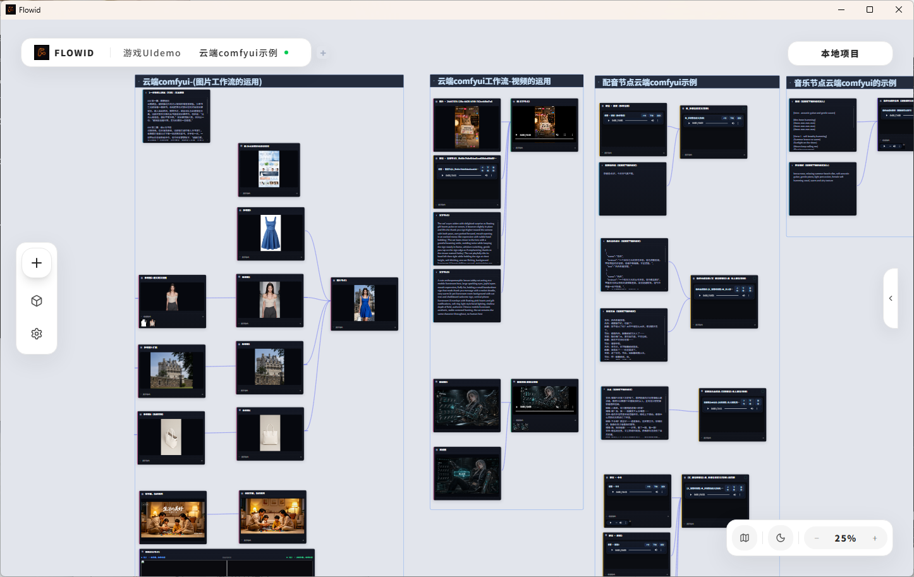
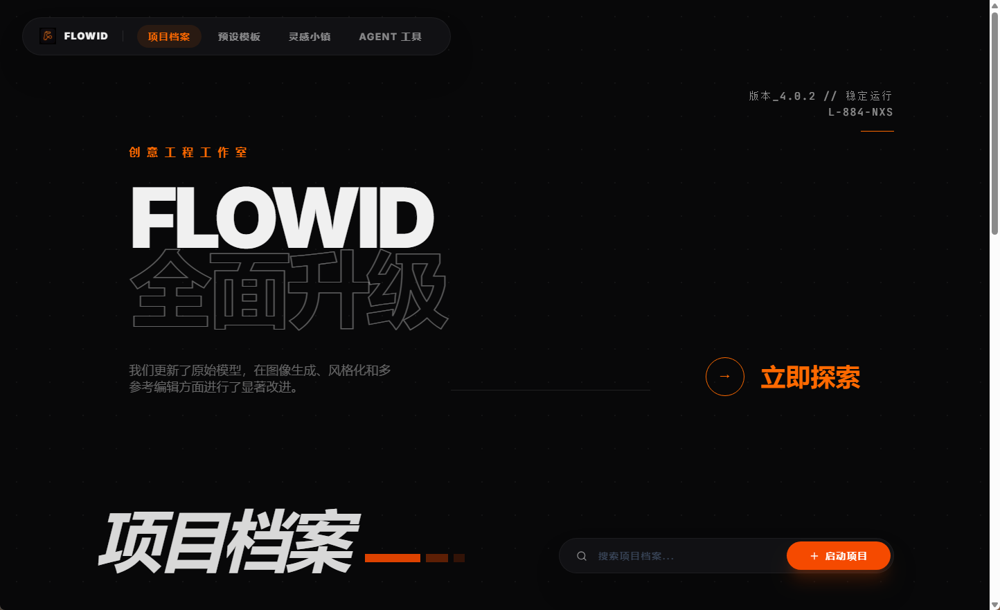
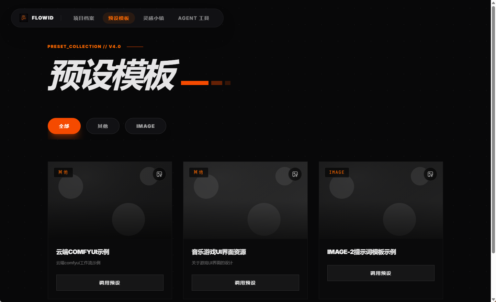
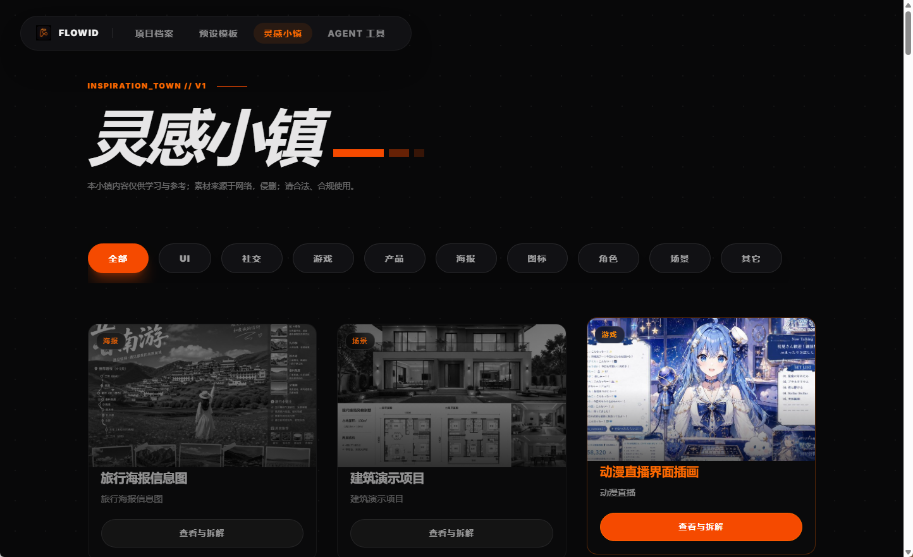
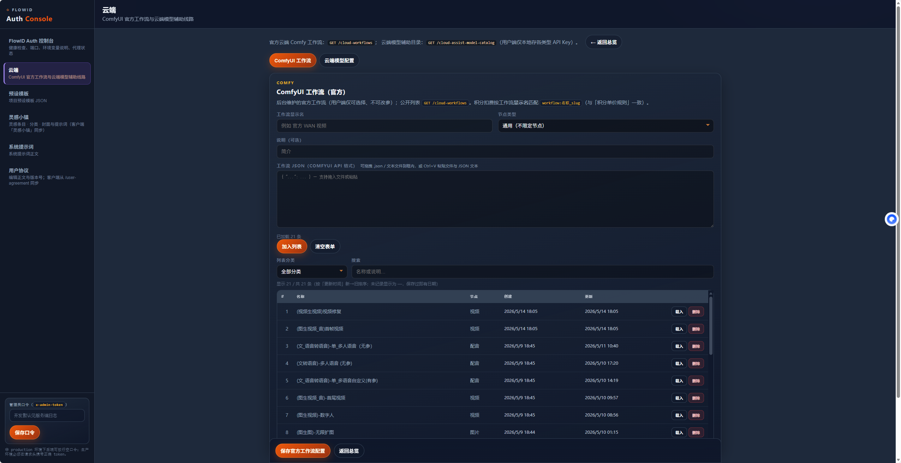
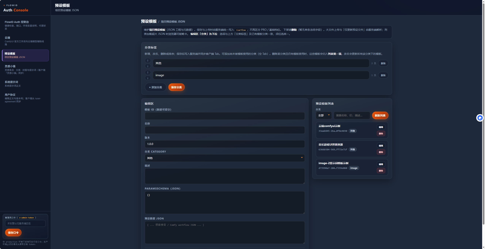
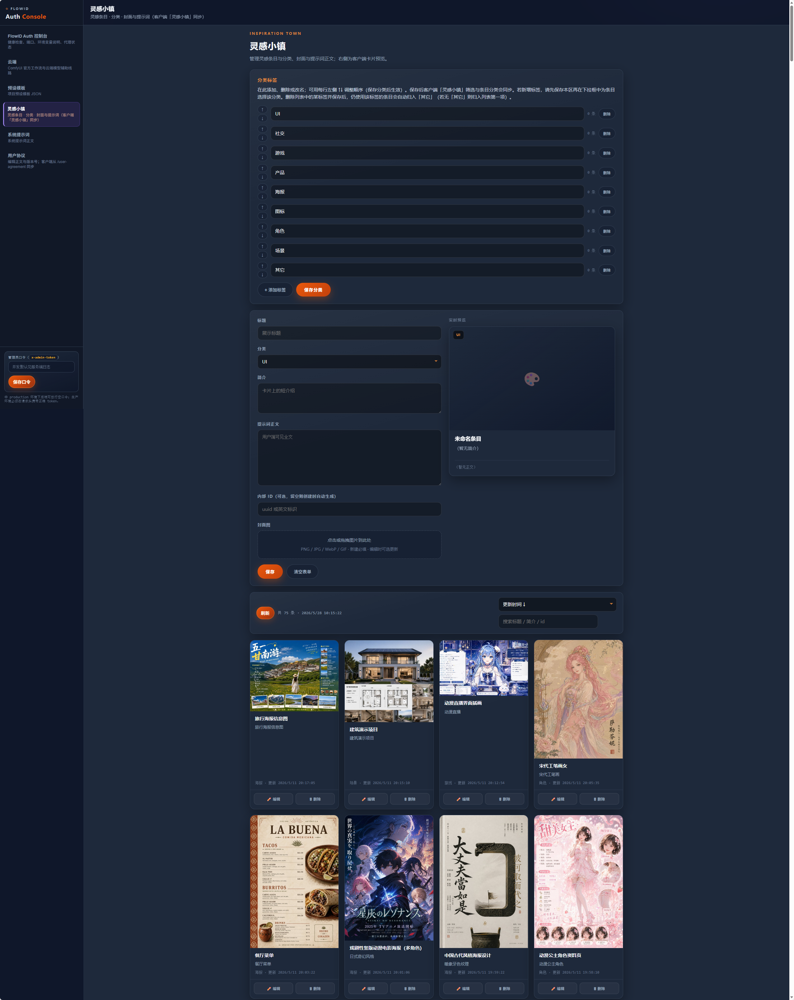
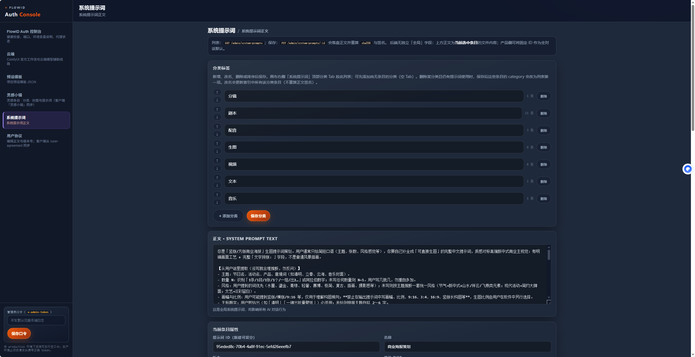

<div align="center">

# Flowid

**一款无限画布软件，搞定 AI 内容全流程**

[](LICENSE)
[](https://react.dev/)
[](https://www.typescriptlang.org/)
[](https://vite.dev/)
[](https://github.com/comfyanonymous/ComfyUI)

[功能一览](#-功能一览) · [界面预览](#-界面预览) · [快速开始](#-快速开始) · [开发文档](#-开发文档)

<br />



<sub>无限画布 · 节点编排 · 连线执行 · 本地 / 云端 Comfy 工作流</sub>

</div>

---

## ✨ 这是什么？

**Flowid** 把 AI 内容生产拆成**可复用节点**，在**无限画布**上拖拽、连线、一键跑通整条流水线——从一张海报到数字人短视频，都在同一个工程里完成。

| 特点 | 说明 |
|------|------|
| 🧩 **节点化** | 生图、视频、配音、音乐、全景……每类能力独立节点，参数可保存 |
| 🔗 **ComfyUI** | 本地 Comfy 或云端 Comfy API，工作流 JSON 导入即用 |
| 🖥️ **Web + 桌面** | 浏览器开发；Electron 打包 Windows 安装包 |
| 🤖 **AI Agent** | 画布内对话助手；智剧通短剧流水线 |
| 📦 **可选 Auth** | 自建服务分发预设模板、云端工作流、灵感市场、管理后台 |

---

## 🚀 功能一览

### 🎨 图像

| 功能 | 说明 |
|:--|:--|
| **生图** | 文生图 / 图生图，多模型 Comfy 工作流 |
| **抠图** | 主体分离、透明底 |
| **一键去字** | 画面文字 / 水印清理 |
| **换背景** | 背景替换与场景融合 |
| **控制角度** | Multi-angle 多角度控制与预览 |
| **图像高清修复** | 超分、细节增强、大图 tiled 修复 |
| **单图 / 多图编辑** | 单帧精修或多参考图联合编辑 |
| **图像对比** | 生成前后同屏对比 |

### 🎬 视频与数字人

| 功能 | 说明 |
|:--|:--|
| **首尾视频** | 首帧 + 尾帧驱动视频生成 |
| **视频修复** | 画质增强、瑕疵修复 |
| **数字人** | 口型 / 动作驱动虚拟人 |
| **视频合成** | 多片段合成为一条成片（Beta） |

### 🎙 音频与音乐

| 功能 | 说明 |
|:--|:--|
| **有参配音** | 带参考音色的 TTS / 语音克隆 |
| **无参配音** | 单人 / 多人旁白，无需预上传参考 |
| **音乐微调** | BGM、氛围音轨生成与参数微调 |

### 🌐 空间

| 功能 | 说明 |
|:--|:--|
| **图片 → VR360 全景** | 全景浏览、视角导出 |

### 🧠 工作流与生态

| 功能 | 说明 |
|:--|:--|
| **文本 / 剧本节点** | 文案、分镜、提示词扩写 |
| **预设模板** | 官方 / 自建模板，一键载入工程 |
| **灵感小镇** | 灵感市场浏览与引用 |
| **素材库** | 人物 / 场景 / 道具等分类（桌面版同步文件夹） |
| **系统提示词库** | 文本工作流 `__SYSTEM_PROMPT__` 统一管理 |
| **敏感词过滤** | 可选 Aho–Corasick 词库 |
| **工程持久化** | 项目 JSON、封面、历史记录 |

---

## 🖼 界面预览

### 客户端 · 首页与入口

<table>
  <tr>
    <td width="50%" align="center">
      
      <br /><sub><b>项目档案</b> — 工程列表、封面、快速进入画布</sub>
    </td>
    <td width="50%" align="center">
      
      <br /><sub><b>预设模板</b> — 一键调用官方 / 自建模板</sub>
    </td>
  </tr>
  <tr>
    <td width="50%" align="center">
      
      <br /><sub><b>灵感小镇</b> — 浏览灵感市场、引用到工程</sub>
    </td>
    <td width="50%" align="center">
      
      <br /><sub><b>无限画布</b> — 节点编排、连线、批量执行</sub>
    </td>
  </tr>
</table>

### 管理后台 · Auth 服务

<p align="center">自建 <code>auth-server</code> 后，可通过 Web 管理云端工作流、模板与灵感内容。</p>

<table>
  <tr>
    <td width="50%" align="center">
      
      <br /><sub><b>工作流管理</b> — 云端 Comfy 工作流目录</sub>
    </td>
    <td width="50%" align="center">
      
      <br /><sub><b>预设模板</b> — 模板分组与工程快照</sub>
    </td>
  </tr>
  <tr>
    <td width="50%" align="center">
      
      <br /><sub><b>灵感小镇</b> — 灵感条目与分类</sub>
    </td>
    <td width="50%" align="center">
      
      <br /><sub><b>系统提示词</b> — 文本类工作流提示词库</sub>
    </td>
  </tr>
</table>

---

## 🏗 架构

```text
┌──────────────────────────────────────────────────┐
│  Flowid 客户端（React + Vite + Electron 可选）     │
│  首页 · 无限画布 · Agent · 设置 · 素材库          │
└────────────────────┬─────────────────────────────┘
                     │
       ┌─────────────┼─────────────┐
       ▼             ▼             ▼
  本地 ComfyUI   云端 Comfy     OpenAI 兼容 API
                     │
                     ▼
        Auth 服务（可选，server/auth-server.cjs）
        模板 · 工作流 · 灵感 · 管理后台
```

---

## ⚡ 快速开始

**环境**：Node.js ≥ 18 · npm ≥ 9 · （可选）本机 ComfyUI

```bash
git clone https://github.com/ZhuoZhuo-maker/Flowid.git
cd Flowid
npm install
npm run dev
```

| 地址 | 说明 |
|------|------|
| http://127.0.0.1:5173 | 画布前端 |
| http://127.0.0.1:3721/admin.html | 管理后台 |

**首次使用**：设置 → 配置 Comfy 地址 → 导入 / 选择工作流 → 画布双击添加节点 → 连线运行。

更多命令：`npm run dev:vite` · `npm run auth:dev` · `npm run desktop:dev` · `npm run pack:desktop`

---

## 📚 文档

| 文档 | 内容 |
|------|------|
| [deploy-auth-server.md](./docs/deploy-auth-server.md) | Auth 部署 |
| [pack-bundled-vs-remote.md](./docs/pack-bundled-vs-remote.md) | 随包画廊 |
| [open-source-security-checklist.md](./docs/open-source-security-checklist.md) | 开源安全 |

---

## 📄 开源说明

- 协议：**[MIT](./LICENSE)**
- 仓库内**不含**任何第三方 API Key；云端模型需在设置中自行配置
- 开源版无授权码 / 积分计费，画布与 Agent 可直接执行工作流

---

## ⭐ Star History

[](https://star-history.com/#ZhuoZhuo-maker/Flowid&Date)

---

<div align="center">

**Flowid — 无限画布，串起 AI 内容全流程**

<br />

作者 · **[ZhuoZhuo-maker](https://github.com/ZhuoZhuo-maker)**

[GitHub 仓库](https://github.com/ZhuoZhuo-maker/Flowid) · [MIT License](./LICENSE)

</div>
